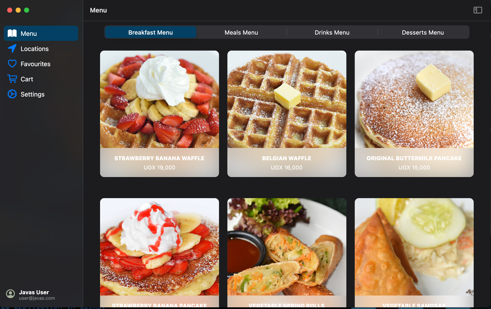
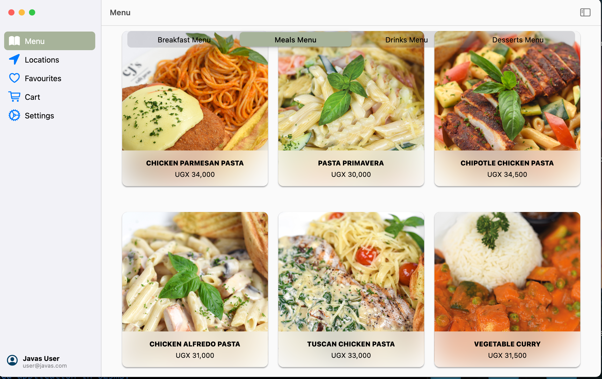
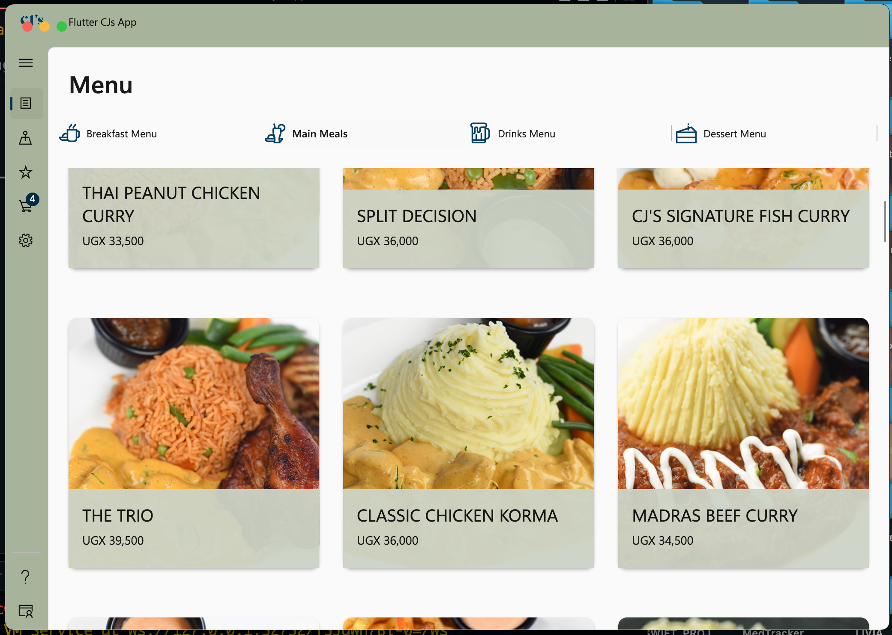

# flutter_days_app
A Flutter project that was created for a Flutter Days 2022 talk, **"Desktop Development isn't Dead: Flutter Desktop"**.

This project goes into showing how a developer is able to using the same dart language for mobile develop apps that are capable of developing for Windows and MacOS.

This project is developed using Flutter Version **2.10.2**(Stable Channel) and Dart version **2.16.1**.
#
## Screenshots

<!-- |Dark Mode (Mac)   |Light Mode(Mac)   |Light Mode (Windows)   |
|---|---|---|
|   |   |   | -->

MacOS Screenshots

Dark Mode

Light Mode

Windows Screenshot

___I did not have a Windows machine at the time of capturing this screenshot hence it is bound to look slightly different when run on an actual Windows machine___

## Overview
This project made use primarily of two distinct packages, [macos_ui](https://pub.dev/packages/macos_ui) and [fluent_ui](https://pub.dev/packages/fluent_ui) to deliver the native look and feel of the respective platforms it was developed for.

There is no claim for a 100% native platform look but this project attempts to get there.

Furthermore, it made use of data from a GraphQL backend provided by myself in order to deliver the content into the apps.

### Notes
- There will be continued effort to add comments in the code to help those trying to understand what the code is doing and how it was written.
- This app was just a starting point to show how desktop development is possible. As such there is alot that can be improved/refactored to showcase better data handling, reduce repetitive code and also to merge similar files under one.
        
    All that is work that can be iterated upon later.
- I do not claim copyright for any and all images used in the app.

## Suggested Further Reading
There is alot more that can be done with Flutter Desktop to not only expand on this project but also to increase your knowledge on the area.

- [Setting up Flutter for desktop development](https://docs.flutter.dev/desktop)
   - Understand the requirements needed to set up your environment for desktop development.
- [Write a Flutter desktop application Codelab](https://codelabs.developers.google.com/codelabs/flutter-github-client?hl=en#4)
  - Walk through a tutorial to develop your first desktop application.
- Ready to package and distribute your Windows app, use the [msix package](https://pub.dev/packages/msix) to create an installer for your application 

